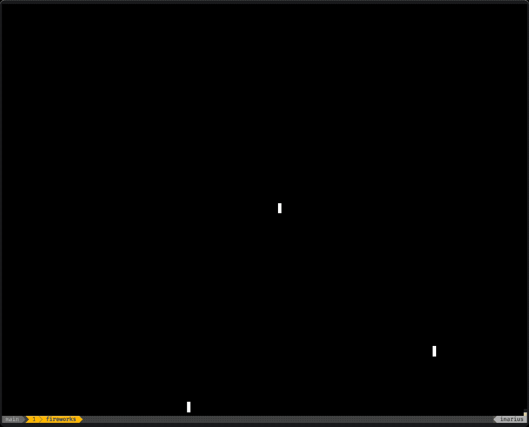

# 🎆 Pixel Fireworks 🧨

## Overview

The `fireworks` implementation is simple fireworks effect within your terminal
build using the [PixelLoop](https://cargo.io/crates/pixel_loop) engine. If you
are interested in how this came to life, check out my YouTube channel
[MrJakob](https://youtube.com/c/mrjakob), where I live code this project and
others.



## Build Instructions

Build the fireworks cli using `cargo`:

```shell
cargo build --release
```

## Usage

Once built, run the `target/release/fireworks` binary to enjoy the show.

The simulation can be exited by pressing the `Q` key.
